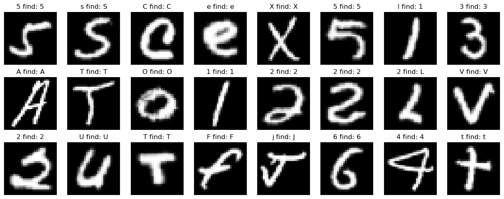

# WebEMNIST

## [Demo at https://etienne248.github.io/WebEMNIST/](https://etienne248.github.io/WebEMNIST/)

## Overview
This is a simple web app that allows you to draw a digit or a letter and get a prediction from a CNN model.
This repo contains code to:
- Train the model with pytorch (emist_cnn.ipynb)
- Export the model to ONNX (emist_cnn.ipynb)
- Load the model in javascript with ONNX Runtime to deploy it on the demo website (index.html)

### Model
The model is a simple CNN with 2 convolutional layers and 2 fully connected layers with batch normalisation. It was trained with pytorch and exported to ONNX.

### Training Data
The model was trained on the EMNIST dataset. This is an alphanumeric dataset with 62 classes. 10 digits, 26 lowercase letters, 26 uppercase letters.

The dataset can be found at [https://www.nist.gov/itl/products-and-services/emnist-dataset](https://www.nist.gov/itl/products-and-services/emnist-dataset) 
or with torchvison:
```python
torchvision.datasets.EMNIST
```


## Installation
```bash
git clone https://github.com/Etienne248/WebEMNIST.git
```
```bash
pip install -r requirements.txt
```
then run the notebook emnist_cnn.ipynb to train the model and export it to ONNX.

## Inference exemple 
Accuracy on test set: 0.8752
